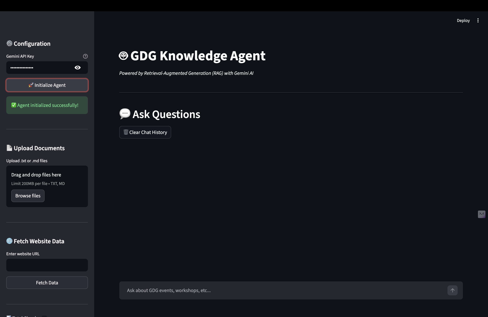
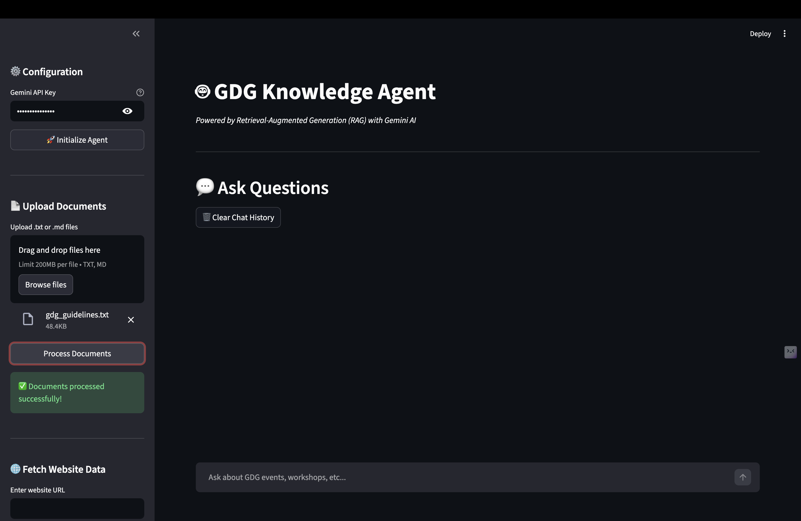
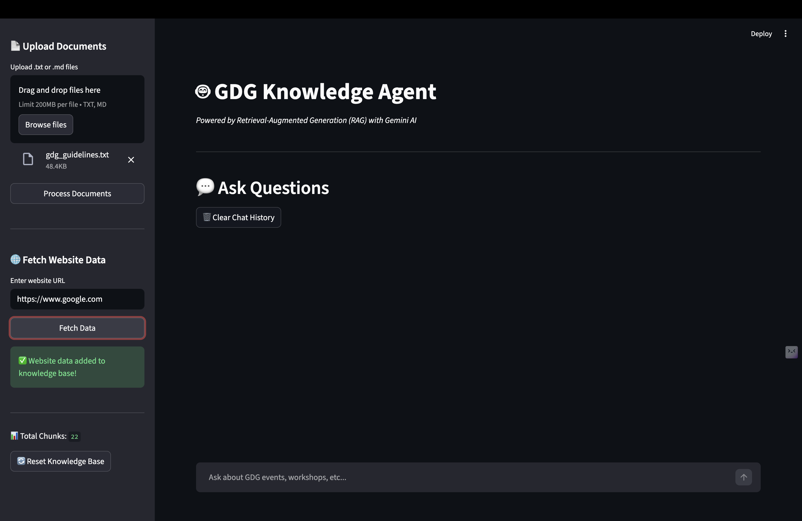
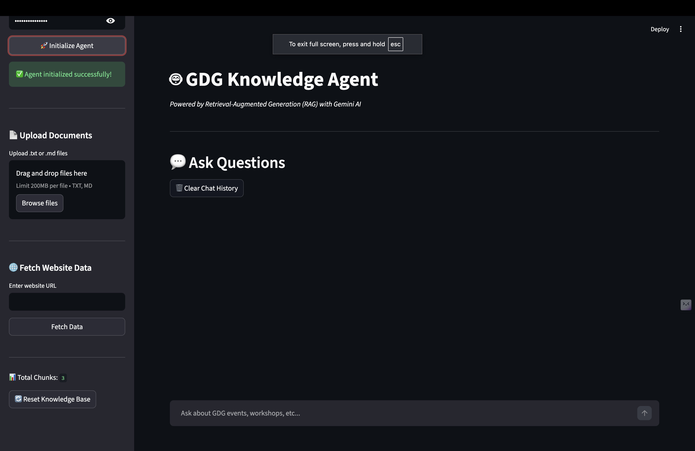

## 🙏 Acknowledgment

This project was built during a technical workshop organized by  
**Google Developers Group (GDG)**, where we explored:

- Retrieval-Augmented Generation (RAG)
- Gemini API integration
- AI system architecture
- Practical knowledge base pipelines

The workshop provided hands-on exposure to real-world AI application development.

---
# GDG Knowledge Agent 🚀

A Retrieval-Augmented Generation (RAG) based Knowledge Agent powered by Gemini AI.

This project allows users to:
- Upload documents
- Fetch website data
- Build a knowledge base
- Ask contextual questions
- Get AI-powered answers

Built as part of a workshop project to understand real-world AI system design.

---

## 🧠 Project Overview

The GDG Knowledge Agent is a lightweight RAG-based system that:

1. Accepts `.txt` and `.md` documents  
2. Fetches website content via URL  
3. Processes and chunks data  
4. Stores it in a knowledge base  
5. Uses Gemini API to generate contextual responses  

This project demonstrates practical understanding of:
- Retrieval-Augmented Generation (RAG)
- Document preprocessing
- API integration
- Knowledge base management
- AI application workflow

---

## ⚙️ Features

- 🔐 Gemini API Key Configuration
- 📂 Document Upload & Processing
- 🌐 Website Data Fetching
- 🧩 Automatic Chunking
- 💬 Conversational Q&A Interface
- ♻ Reset Knowledge Base Option
- 🚀 Deploy-ready Interface

---

## 🏗️ System Architecture (High Level)

User Input  
↓  
Document / Website Data  
↓  
Chunking & Embeddings  
↓  
Knowledge Base  
↓  
Gemini LLM  
↓  
Context-Aware Response  

---

## 🖥️ Application Preview

### 1️⃣ Initial Interface


### 2️⃣ Agent Initialized


### 3️⃣ Document Processing


### 4️⃣ Knowledge Base Built


### 5️⃣ Website Data Integration


---

## 🛠️ Tech Stack

- Python
- Gemini API
- Retrieval-Augmented Generation (RAG)
- Document Chunking
- Streamlit (UI)

---

## 🚀 How to Run

```bash
# Clone the repository
git clone https://github.com/manav15dhupar-ux/Workshop_project.git

# Navigate to project folder
cd Workshop_project

# Install dependencies
pip install -r requriements.txt

# Run the app
streamlit run app.py
